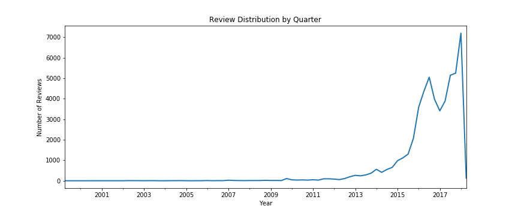
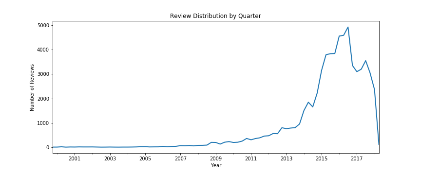
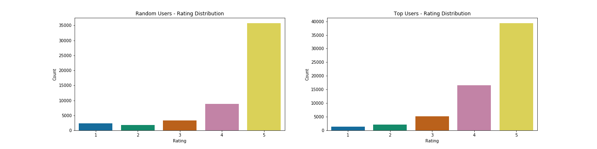
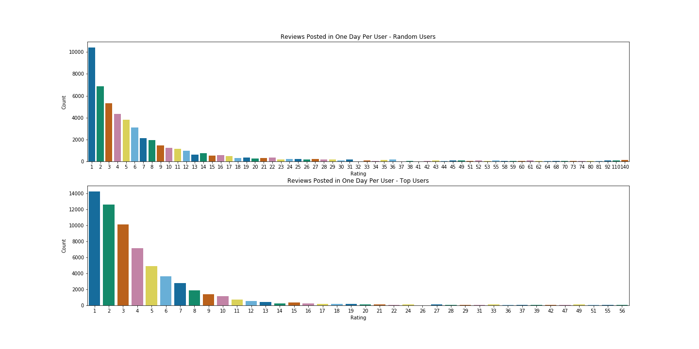
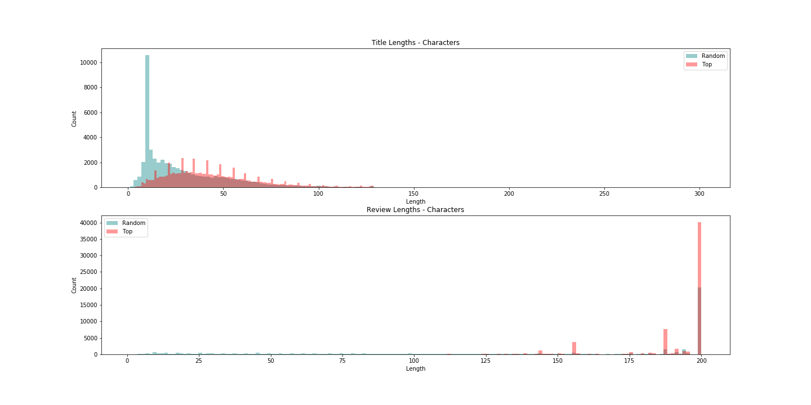
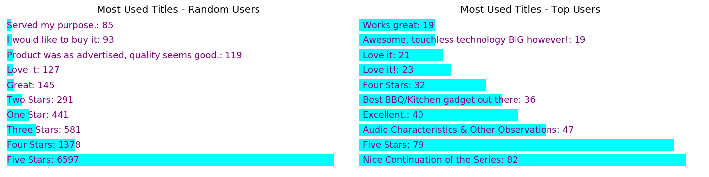
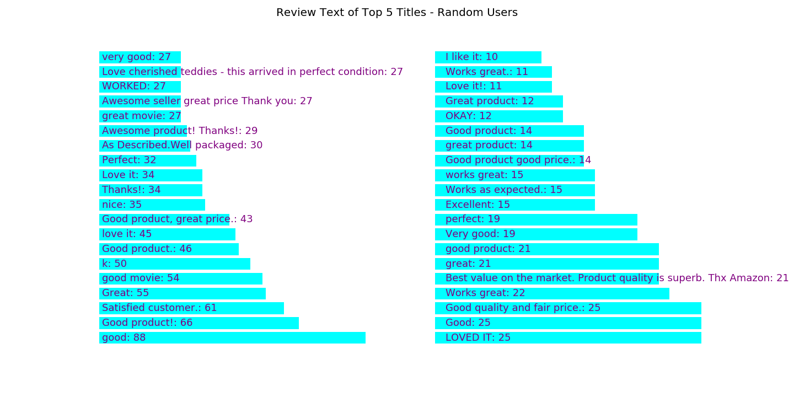

# Finding Incentivized Reviews

Welcome to my Capstone repo!

Table of Contents
=================

* [Introduction](#introduction)
* [Data / Feature Selection](#data-/-feature-selection)
  * [Unsupervised EDA](#unsupervised-eda)
* [Methods](#methods-section)
* [Analysis](#analysis-section)
* [Results](#results)
* [Conclusions](#conclusions)

### Introduction
As consumers continue to shift their buying habits from brick-and-mortar stores to online retailers, consumers have access to billions of products that would not normally be available. But with this gain in product selection, the consumer loses the vital ability to test the quality of the product before the purchase. In return, retailers usually provide detailed product descriptions and consumer reviews/ratings to help consumers make an informed purchase decision.

Majority of purchases take place without a hitch, but there are still many instances where the consumer gets a faulty or not as advertised product. While most big box retailers might provide some sort of money back guarantee, the duped consumer still loses out on time or the gifting opportunity.

  

<caption align="bottom">Figure 1. Amazon Product Fail (Google.com - Image Search)</caption>

Why would something like the picture above still happen even with high average product ratings? Fake or potentially incentivized reviews. Sellers know that reviews and ratings influence consumer purchases. Just a small difference of +0.38 stars on Amazon can move a product from the 54th percentile to the 94th percentile, therefore a group of fake / incentivized reviews can make a product look like one of the best.

  

<caption align="bottom">Figure 2. Average Rating of Amazon Products (techcrunch.com) </caption>

While Amazon has tons of bots that check for fake reviews, it is still very hard to determine if a review was in some way incentivized. The following is a good example of something getting through the cracks.

  

<caption align="bottom">Figure 3. Kettle Reviews (Amazon.com) </caption>

As a result, the scope of this project will be to try and identify potential incentivized reviews on Amazon.

### Data / Feature Selection
The data for this project was a real challenge as there wasn't a dataset available with labeled incentivized / legitimate. As a result, the project is split into two sections:
  1. Unsupervised
    - Determine which reviews / reviewers were incentivized
  2. Supervised
    - Predict incentivized / legitimate reviews from labeled dataset.

#### Unsupervised EDA
I scraped review data from two sources: products listed on a discount site and Amazon's top reviewer list. The top reviewer list would give me a good baseline of what exactly Amazon determines is a real genuine review.

  

<caption align="bottom">Figure 4. Random Users Review Timeline </caption>

  

<caption align="bottom">Figure 5. Top Users Review Timeline </caption>

As seen in the two review history timeline, there isn't much too alarming and is consistent with my predictions. There is a visible drop in late 2016 as Amazon officially changed the review policies and banned incentivized reviews. There is also an expected drop in 2018, as new products might be lower on recommendation pages.

  

<caption align="bottom">Figure 6. Ratings Distribution </caption>

As seen in Figure 6, there isn't much of a difference between my random users compared to my top users. Both are heavily left skewed but the random users show a bimodal distribution. I am not too worried because users tend to leave reviews for products that were really good or really bad.

I needed to create a determination on how many reviews users were posting in a given time period. It seemed that checking the number of reviews in any given day would be a good indicator on activity.

  

<caption align="bottom">Figure 7. Review per Day Distribution </caption>

As seen above, there are many high volume reviewers, but not even the top Amazon reviewers post more than 60 reviews in any single given day. This is potentially the first indicator.

Next, I looked into the title and review lengths. The way I gathered my data, I could not get the whole review body but only the first 200 characters. Therefore, the review length is a little misleading. The title length did bring up some interesting distributions as there was a large uptick around 10 characters. Digging further, I looked into the top used titles.

  

<caption align="bottom">Figure 8. Title/Review Length Distribution </caption>

  

<caption align="bottom">Figure 9. Most Used Titles </caption>

As seen, the random users tend to use more simple titles as well as titles that are unhelpful. Many of these titles can be seen as a potential indicator for fake reviews. Then I was able to narrow down some of the common review text based on the most common titles used.

  

<caption align="bottom">Figure 10. Review Body Text </caption>

As predicted, the review body was not helpful either and can be seen as generic and easy to fake. The most common review titles along with review body length are used as potential indicators going forward.

#### Part 2: Supervised

### Methods Section

### Analysis Section

### Results

### Conclusions
