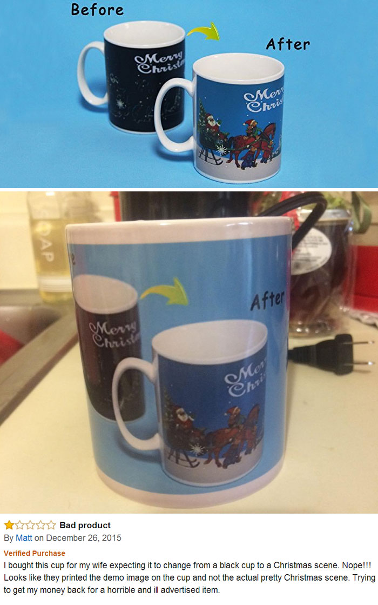
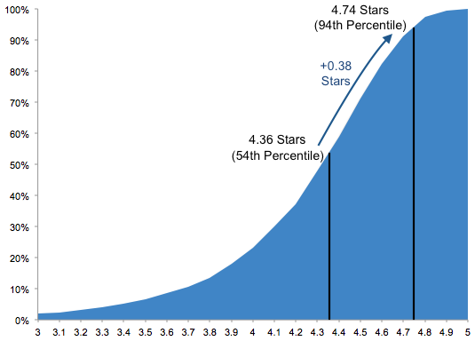

# Finding Incentivized Reviews

Welcome to my Capstone repo!

Table of Contents
=================

* [Introduction](#introduction)
* [Data / Feature Selection](#data-/-feature-selection)
  * [Part 1: Unsupervised](#part-1:-unsupervised)
  * [Part 2: Supervised](#part-2:-supervised)
* [Methods](#methods-section)
* [Analysis](#analysis-section)
* [Results](#results)
* [Conclusions](#conclusions)

### Introduction
As consumers continue to shift their buying habits from brick-and-mortar stores to online retailers, consumers have access to billions of products that would not normally be available. But with this gain in product selection, the consumer loses the vital ability to test the quality of the product before the purchase. In return, retailers usually provide detailed product descriptions and consumer reviews/ratings to help consumers make an informed purchase decision.

Majority of purchases take place without a hitch, but there are still many instances where the consumer gets a faulty or not as advertised product. While most big box retailers might provide some sort of money back guarantee, the duped consumer still loses out on time or the gifting opportunity.

  

<caption align="bottom">**Figure 1.** Amazon Product Fail (Google.com - Image Search) </caption>

Why would something like the picture above still happen even with high average product ratings? Fake or potentially incentivized reviews. Sellers know that reviews and ratings influence consumer purchases. Just a small difference of +0.38 stars on Amazon can move a product from the 54th percentile to the 94th percentile, therefore a group of fake / incentivized reviews can make a product look like one of the best.

  

<caption align="bottom">**Figure 2.** Average Rating of Amazon Products (techcrunch.com) </caption>

While Amazon has tons of bots that check for fake reviews, it is still very hard to determine if a review was in some way incentivized. The scope of this project will be to try and identify potential incentivized reviews on Amazon.

### Data / Feature Selection
The data for this project was a real challenge as there wasn't a dataset available with labeled incentivized / legitimate. As a result, the project is split into two sections:
  1. Unsupervised
    - Determine which reviews / reviewers were incentivized
  2. Supervised
    - Predict incentivized / legitimate reviews from labeled dataset.

#### Part 1: Unsupervised

#### Part 2: Supervised

### Methods Section
  - Explain how you gathered and analyzed data.

### Analysis Section
  - Explain what you analyzed. Include any charts here.

### Results
  - Describe the results of your analysis.

### Conclusions

Restate the questions from your introduction.
Restate important results.
Include any recommendations for additional data as needed.
